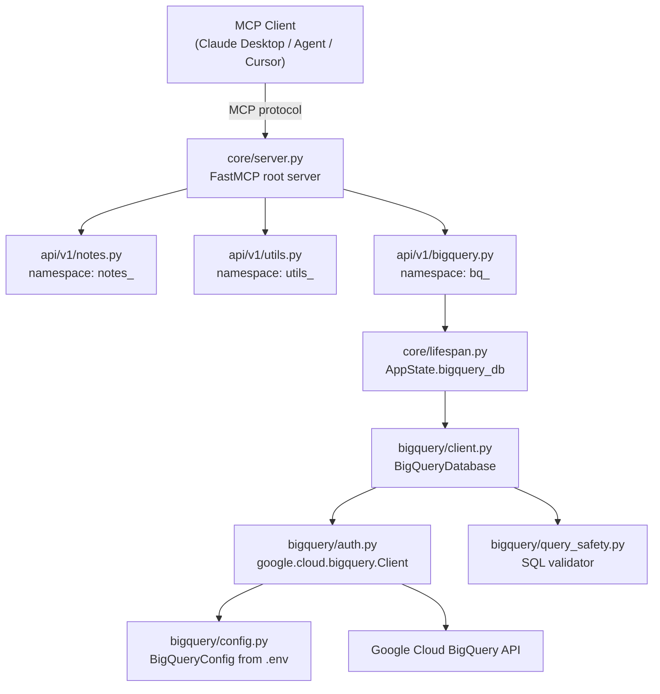
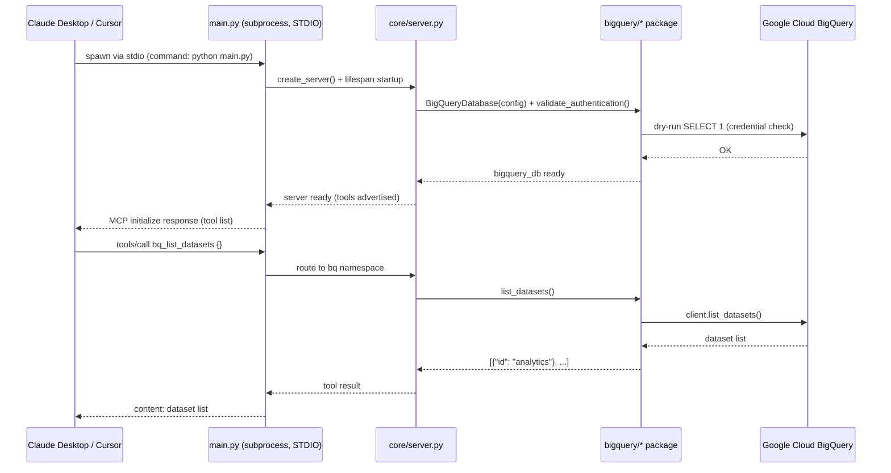

# MCP Tooling — Modular FastMCP Server

## Table of Contents

- [Overview](#overview)
- [Prerequisites](#prerequisites)
- [Installation](#installation)
- [Running Locally (no BigQuery)](#running-locally-no-bigquery)
- [Running with BigQuery](#running-with-bigquery)
  - [Step 1 — Authenticate](#step-1--authenticate)
  - [Step 2 — Configure](#step-2--configure)
  - [Step 3 — Validate credentials](#step-3--validate-credentials-only-no-server)
  - [Step 4 — Start the server](#step-4--start-the-server)
  - [Step 5 — Test via the agent](#step-5--test-via-the-agent)
- [Billing Protection](#billing-protection)
- [Dataset Access Control](#dataset-access-control)
- [Vector Search Setup](#vector-search-setup)
- [Running Tests](#running-tests)
- [Claude Desktop / Cursor Integration](#claude-desktop--cursor-integration)
- [Architecture Diagrams](#architecture-diagrams)
  - [BigQuery Implementation Stack](#bigquery-implementation-stack)
  - [Agent ↔ BigQuery Communication Flow](#agent--bigquery-communication-flow)
  - [Claude Desktop / Cursor Integration Flow](#claude-desktop--cursor-integration-flow)
- [Why Run the Server Separately](#why-run-the-server-separately)
- [Project Structure](#project-structure)
- [Setup](#setup)
- [Server Commands](#server-commands)
- [Agent Commands](#agent-commands)
- [Available Tools](#available-tools)
- [Available Resources](#available-resources)
- [Available Prompts](#available-prompts)
- [Troubleshooting](#troubleshooting)

---

## Overview

A production-grade [Model Context Protocol](https://modelcontextprotocol.io/) (MCP) server built with FastMCP.  
Modular sub-server architecture — each domain is independent, mounted with a namespace prefix.

**Domains:**

| Namespace | Prefix | Tools |
|---|---|---|
| Notes | `notes_` | create, get, list, search, update, delete |
| Utils | `utils_` | echo, server_time, http_get, process_items |
| **BigQuery** | **`bq_`** | **bq_run_query, bq_list_datasets, bq_list_tables, bq_get_table, bq_vector_search** |

BigQuery is **optional** — the server starts normally when `BIGQUERY_PROJECT_ID` is not set.

---

## Prerequisites

- Python 3.10+
- pip
- (BigQuery) Google Cloud SDK: `gcloud` CLI — [install guide](https://cloud.google.com/sdk/docs/install)
- (Agent) [LM Studio](https://lmstudio.ai/) or any OpenAI-compatible local LLM

---

## Installation

```bash
git clone <repo-url>
cd mcp_tooling_modular

python -m venv .venv
# Windows:
.venv\Scripts\activate
# Linux / macOS:
source .venv/bin/activate

pip install -r requirements.txt

cp .env.example .env
# Edit .env with your settings
```

---

## Running Locally (no BigQuery)

```bash
# Smoke-test demo — runs all tools in-process and exits
python main.py --demo

# STDIO server (for Claude Desktop / Cursor)
python main.py

# HTTP server on port 8000
python main.py --http

# Custom port
python main.py --http --port 9000

# Interactive agent REPL (requires LM Studio running)
python -m agent.cli --model "your-model-id"

# One-shot agent query
python -m agent.cli --query "What is 12 factorial?"
```

---

## Running with BigQuery

### Step 1 — Authenticate

**Option A — User credentials (recommended for local development):**
```bash
gcloud auth application-default login
```

**Option B — Service account key file:**
```bash
# In .env:
GOOGLE_APPLICATION_CREDENTIALS=/path/to/service-account.json
```

Your GCP account needs these IAM roles on the project:
- `BigQuery Data Viewer` — read datasets and tables
- `BigQuery Job User` — execute queries
- `BigQuery Metadata Viewer` — optional, required for vector search auto-discovery

### Step 2 — Configure

Edit `.env`:
```
BIGQUERY_PROJECT_ID=your-gcp-project-id
BIGQUERY_LOCATION=US
```

Optionally restrict to specific datasets:
```
BIGQUERY_ALLOWED_DATASETS=analytics,raw_logs
```

### Step 3 — Validate credentials only (no server)

```bash
# Starts server, validates, then exits (via --demo flag which calls lifespan)
python main.py --demo
```

Look for:
```
[bigquery] Validating credentials for project: your-project
[bigquery] ✅ Credentials and permissions validated
```

### Step 4 — Start the server

```bash
# HTTP mode
python main.py --http

# STDIO mode (for Claude Desktop / Cursor)
python main.py
```

### Step 5 — Test via the agent

```bash
python -m agent.cli --model "your-lm-studio-model-id"
```

Example queries:
```
You: List all datasets in my BigQuery project
You: Show me the schema of my_dataset.users
You: What are the top 5 tables by row count in analytics?
You: Run this query: SELECT COUNT(*) as n FROM my_dataset.orders LIMIT 1
You: What tables have embedding columns?
```

---

## Billing Protection

Every query is subject to a **billing cap** (default: ~$0.50 USD per query).

```
BIGQUERY_MAX_BYTES_BILLED=109951162777   # ~$0.50 at $5/TiB
```

If a query exceeds this cap, BigQuery rejects it before charging you.  
Adjust in `.env` to fit your budget. Set to `0` to remove the cap (not recommended).

---

## Dataset Access Control

To restrict the server to specific datasets:
```
BIGQUERY_ALLOWED_DATASETS=analytics,staging
```

Any tool call referencing a dataset not in the list returns an "Access Denied" error — the BigQuery API is never called.

---

## Vector Search Setup

1. Enable:  
   ```
   BIGQUERY_VECTOR_SEARCH_ENABLED=true
   ```
2. Set your BigQuery ML embedding model path:  
   ```
   BIGQUERY_EMBEDDING_MODEL=your-project.your-dataset.your-model
   ```
3. Optionally pin specific tables (skips INFORMATION_SCHEMA auto-discovery):  
   ```
   BIGQUERY_EMBEDDING_TABLES=my_dataset.products,my_dataset.articles
   ```
4. Choose distance metric:  
   ```
   BIGQUERY_DISTANCE_TYPE=COSINE    # COSINE | EUCLIDEAN | DOT_PRODUCT
   ```

Use `bq_vector_search` with `query_text=""` to discover embedding tables.  
Set `query_text` to run a semantic similarity search.

---

## Running Tests

### Unit tests — no GCP required

```bash
# All unit tests
pytest tests/bigquery/test_query_safety.py tests/bigquery/test_config.py tests/bigquery/test_tools.py -v

# Just query safety (pure Python, fastest)
pytest tests/bigquery/test_query_safety.py -v

# All non-integration tests across the whole project
pytest -m "not integration" -v
```

### Integration tests — requires real GCP

```bash
# Set credentials and project first
export BIGQUERY_PROJECT_ID=your-project
export BIGQUERY_LOCATION=US
gcloud auth application-default login

# Run integration tests
pytest tests/bigquery/test_integration.py -m integration -v
```

Integration tests will automatically skip when `BIGQUERY_PROJECT_ID` is not set.

---

## Claude Desktop / Cursor Integration

Add to your MCP client config (STDIO mode):

```json
{
  "mcpServers": {
    "mcp-tooling": {
      "command": "python",
      "args": ["/absolute/path/to/mcp_tooling_modular/main.py"],
      "env": {
        "BIGQUERY_PROJECT_ID": "your-gcp-project-id",
        "BIGQUERY_LOCATION": "US",
        "GOOGLE_APPLICATION_CREDENTIALS": "/path/to/service-account.json"
      }
    }
  }
}
```

---

## Architecture Diagrams

### BigQuery Implementation Stack

```
┌─────────────────────────────────────────────────────────────────┐
│                    MCP CLIENT (Claude / Agent)                   │
└────────────────────────────┬────────────────────────────────────┘
                             │  MCP protocol (STDIO or HTTP/SSE)
┌────────────────────────────▼────────────────────────────────────┐
│                  core/server.py  (FastMCP root)                  │
│  ┌──────────┐  ┌──────────┐  ┌────────────────┐           │
│  │ notes_*  │  │ utils_*  │  │     bq_*       │           │
│  │(notes.py)│  │(utils.py)│  │(bigquery.py)   │           │
│  └──────────┘  └──────────┘  └───────┬────────┘           │
│                                                     │           │
│  core/lifespan.py → AppState.bigquery_db ───────────┘           │
└─────────────────────────────────────────────────────────────────┘
                             │
              ┌──────────────▼──────────────┐
              │   bigquery/client.py         │
              │   BigQueryDatabase           │
              │  ┌────────────────────────┐  │
              │  │ asyncio.to_thread()    │  │
              │  │  run_query()           │  │
              │  │  list_datasets()       │  │
              │  │  list_tables()         │  │
              │  │  get_table()           │  │
              │  │  vector_search()       │  │
              │  └──────────┬─────────────┘  │
              └─────────────┼────────────────┘
                            │
              ┌─────────────▼────────────────┐
              │  bigquery/auth.py             │
              │  google.cloud.bigquery.Client │
              │  ADC  or  service-account key │
              └─────────────┬────────────────┘
                            │
              ┌─────────────▼────────────────┐
              │  bigquery/query_safety.py     │
              │  • Strip -- and /* */ comments│
              │  • Block DML / DDL / EXPORT   │
              │  • Quote-aware ; guard        │
              │  • Billing cap enforcement    │
              └──────────────────────────────┘
```



---

### Agent ↔ BigQuery Communication Flow

```
  User (terminal)
       │
       ▼
  agent/cli.py
       │   starts
       ▼
  agent/chat_session.py
       │   prompt loop
       ▼
  agent/agent_loop.py ──────────────────────────────────────────┐
       │                                                         │
       │  1. POST /v1/chat/completions                           │
       ▼                                                         │
  LM Studio (local LLM)                                         │
       │                                                         │
       │  2. returns tool_call: bq_run_query({sql: "..."})       │
       ▼                                                         │
  agent/agent_loop.py                                           │
       │                                                         │
       │  3. in-process FastMCP Client call                      │
       ▼                                                         │
  core/server.py → api/v1/bigquery.py                          │
       │                                                         │
       │  4. bigquery_db.run_query(sql)                          │
       │     → asyncio.to_thread(client.query)                   │
       ▼                                                         │
  Google Cloud BigQuery API                                     │
       │                                                         │
       │  5. returns rows / error                                │
       ▼                                                         │
  agent/agent_loop.py ◄──────────────────────────────────────── ┘
       │
       │  6. appends tool result, re-calls LLM
       ▼
  LM Studio → final answer
       │
       ▼
  User (terminal output)
```

```mermaid
sequenceDiagram
    participant U as User (terminal)
    participant CLI as agent/cli.py
    participant Loop as agent/agent_loop.py
    participant LLM as LM Studio (local LLM)
    participant MCP as core/server.py (FastMCP)
    participant BQ as bigquery/client.py
    participant GCP as Google Cloud BigQuery

    U->>CLI: typed message
    CLI->>Loop: run_agent_loop(messages)
    Loop->>LLM: POST /v1/chat/completions
    LLM-->>Loop: tool_call: bq_run_query(sql)
    Loop->>MCP: in-process client.call_tool("bq_run_query", {sql})
    MCP->>BQ: run_query(sql)
    BQ->>GCP: asyncio.to_thread(client.query(...))
    GCP-->>BQ: QueryJob → rows
    BQ-->>MCP: list[dict] rows
    MCP-->>Loop: tool result
    Loop->>LLM: append tool result, re-call
    LLM-->>Loop: final assistant message
    Loop-->>CLI: response text
    CLI-->>U: printed answer
```

---

### Claude Desktop / Cursor Integration Flow

```
  Claude Desktop / Cursor
       │
       │  reads claude_desktop_config.json / .cursorrules
       │
       │  "command": "python main.py"
       │  spawns subprocess over STDIO
       ▼
  main.py (STDIO mode)
       │  FastMCP STDIO transport
       ▼
  core/server.py
  ├── notes_* tools
  ├── utils_* tools
  └── bq_*    tools ──► BigQueryDatabase ──► GCP

  ┌──────────────────────────────────────────────┐
  │  Claude Desktop config example               │
  │                                              │
  │  {                                           │
  │    "mcpServers": {                           │
  │      "mcp-tooling": {                        │
  │        "command": "python",                  │
  │        "args": ["/path/to/main.py"],         │
  │        "env": {                              │
  │          "BIGQUERY_PROJECT_ID": "my-project",│
  │          "BIGQUERY_LOCATION": "US"           │
  │        }                                     │
  │      }                                       │
  │    }                                         │
  │  }                                           │
  └──────────────────────────────────────────────┘
```



---

## Troubleshooting

### `No Google Cloud credentials found`
```bash
gcloud auth application-default login
# or set GOOGLE_APPLICATION_CREDENTIALS in .env
```

### `Permission denied`
Your account is missing BigQuery IAM roles. Add in GCP Console:
- `BigQuery Data Viewer`
- `BigQuery Job User`

### `Project not found` / `Project access issue`
- Verify `BIGQUERY_PROJECT_ID` matches your GCP project ID exactly.
- Ensure the BigQuery API is enabled: https://console.cloud.google.com/apis/library/bigquery.googleapis.com

### `BigQuery location issue`
- Verify `BIGQUERY_LOCATION` matches where your datasets live.
- Common values: `US`, `EU`, `us-central1`, `europe-west4`.

### `Quota exceeded`
- Check project quotas: https://console.cloud.google.com/iam-admin/quotas
- Lower `BIGQUERY_MAX_BYTES_BILLED` to reduce per-query cost exposure.

### `Discovery requires BigQuery Metadata Viewer role` (vector search)
- Either grant the `BigQuery Metadata Viewer` role, or
- Set `BIGQUERY_EMBEDDING_TABLES=dataset.table1,dataset.table2` to skip auto-discovery.

### BigQuery tools not appearing
- Check server startup log for `[bigquery] ✅ Credentials and permissions validated`
- If you see `[bigquery] BigQuery disabled (BIGQUERY_PROJECT_ID not set)`, set the env var and restart.

---

## Project Structure

```
main.py                  — Entry point (STDIO / HTTP / demo modes)
core/
  server.py              — Server factory, sub-server mounting, middleware
  lifespan.py            — AppState, startup/shutdown (BigQuery init here)
api/v1/
  notes.py               — Notes tools
  utils.py               — Utility tools
  bigquery.py            — BigQuery tools (bq_* namespace)
bigquery/
  __init__.py
  config.py              — Typed config from env vars
  auth.py                — Credential factory + helpful error messages
  query_safety.py        — SQL safety validator (blocks DML/DDL, comment injection)
  client.py              — BigQueryDatabase class (async, asyncio.to_thread)
schemas/models.py        — Pydantic input/output models
resources/resources.py   — MCP resources (bq://config, config://server, notes://)
prompts/prompts.py       — MCP prompts (query builder, schema explorer)
middlewares/audit.py     — Audit + request counter middleware
agent/
  cli.py                 — Agent CLI entry point
  chat_session.py        — Interactive REPL
  agent_loop.py          — LLM + tool-call loop
  config.py              — Agent defaults + system prompt
tests/
  bigquery/
    test_query_safety.py — Unit tests (no GCP)
    test_config.py       — Unit tests (no GCP)
    test_tools.py        — Unit tests with mocked BigQuery client
    test_integration.py  — Integration tests (requires real GCP)
.env.example             — All environment variables documented
```

## Why Run the Server Separately

The MCP server is the tool provider. It can operate in two modes:

1. **STDIO mode** -- the server communicates over stdin/stdout. This is how
   Claude Desktop and Cursor connect to MCP servers. No port, no network -- the
   MCP client spawns the server as a subprocess and talks to it directly.

2. **HTTP mode** -- the server listens on a port and exposes a streamable HTTP
   endpoint at `/mcp`. This is for remote clients, web applications, load-balanced
   deployments, or any client that connects over the network.

Running the server separately means:

- Multiple clients can connect to one server instance (HTTP mode).
- The server stays up even when a client disconnects.
- You can add health checks, metrics, and readiness probes for orchestrators
  like Kubernetes.
- You can develop and test tools without needing an LLM -- use `--demo` to
  exercise every tool, resource, and prompt in-process.

The included `agent/` module demonstrates the alternative: connecting to the
server in-process (no network, no subprocess) for local development and
single-user use.

## Project Structure

```
mcp_tooling_modular/
|-- main.py                 Entry point (argparse, server startup, demo)
|-- server.py               Server composition (mounts, middleware, auth)
|-- lifespan.py             AppState dataclass and startup/shutdown lifecycle
|-- demo.py                 In-process smoke test for all capabilities
|-- requirements.txt        Python dependencies
|-- schemas/
|   |-- __init__.py
|   |-- models.py           Pydantic models (NoteCreate, SearchQuery, etc.)
|-- middlewares/
|   |-- __init__.py
|   |-- audit.py            AuditMiddleware, RequestCounterMiddleware
|-- api/
|   |-- __init__.py
|   |-- routes.py           Custom HTTP routes (/health, /ready, /metrics)
|   |-- v1/
|       |-- __init__.py
|       |-- notes.py        Notes sub-server (create, get, search, delete, list)
|       |-- utils.py        Utils sub-server (echo, server_time, http_get, process_items)
|-- resources/
|   |-- __init__.py
|   |-- resources.py        MCP resources (config://server, notes://index, notes://{id})
|-- prompts/
|   |-- __init__.py
|   |-- prompts.py          MCP prompts (summarize_notes, debug_error)
|-- agent/
    |-- __init__.py
    |-- config.py           Agent defaults and system prompt
    |-- tool_converter.py   MCP-to-OpenAI tool schema conversion
    |-- agent_loop.py       Core LLM + tool-calling loop
    |-- chat_session.py     Interactive REPL and one-shot mode
    |-- cli.py              Agent CLI entry point
    |-- README.md           Agent-specific documentation
```

## Setup

```bash
cd mcp_tooling_modular
python -m venv .venv
source .venv/Scripts/activate    # Windows (Git Bash / MSYS2)
# source .venv/bin/activate      # macOS / Linux
pip install -r requirements.txt
```

## Server Commands

All commands assume you are in `mcp_tooling_modular/` with the venv activated.

**Run the in-process demo (no server, no network -- tests all tools, resources, prompts):**

```bash
python main.py --demo
```

Expected output ends with:

```
============================================================
  Demo complete -- all systems nominal.
============================================================
```

**Run as STDIO server (for Claude Desktop, Cursor, or any MCP client that spawns a subprocess):**

```bash
python main.py
```

To configure in Claude Desktop, add to your `claude_desktop_config.json`:

```json
{
  "mcpServers": {
    "production-demo": {
      "command": "python",
      "args": ["path/to/mcp_tooling_modular/main.py"]
    }
  }
}
```

**Run as HTTP server:**

```bash
python main.py --http
```

This starts the server on `http://127.0.0.1:8000` with:

- MCP endpoint: `http://127.0.0.1:8000/mcp`
- Health check: `http://127.0.0.1:8000/health`
- Readiness probe: `http://127.0.0.1:8000/ready`
- Metrics: `http://127.0.0.1:8000/metrics`

**Run on a custom host and port:**

```bash
python main.py --http --host 0.0.0.0 --port 9000
```

**Verify endpoints with curl:**

```bash
curl http://127.0.0.1:8000/health
# {"status":"ok"}

curl http://127.0.0.1:8000/ready
# {"status":"ready","server":"ProductionDemoServer","version":"1.0.0"}

curl http://127.0.0.1:8000/metrics
# {"uptime_note":"see started_at in lifespan state","endpoint":"/metrics"}
```

## Agent Commands

The agent connects to the MCP server in-process and uses a local LLM (via LM
Studio) to answer questions with tool calls. See `agent/README.md` for full
documentation.

```bash
python -m agent.cli                                    # interactive chat
python -m agent.cli --query "What is 12 factorial?"    # one-shot
python -m agent.cli --verbose                          # show tool calls
```

## Available Tools

After mounting, tools are prefixed with their namespace:

| Tool | Description |
|---|---|
| `notes_create_note` | Create a note with title, body, tags |
| `notes_get_note` | Retrieve a note by ID |
| `notes_search_notes` | Search notes by text and tag filter |
| `notes_delete_note` | Delete a note permanently |
| `notes_list_notes` | List all notes |
| `utils_echo` | Echo a message back |
| `utils_server_time` | Current UTC server time |
| `utils_http_get` | HTTP GET with status and body preview |
| `utils_process_items` | Batch process strings with progress |

## Available Resources

| URI | Description |
|---|---|
| `config://utils/server` | Server configuration (name, version, features) |
| `notes://notes/index` | Notes index stub |
| `notes://notes/{note_id}` | Single note stub (URI template) |

## Available Prompts

| Prompt | Description |
|---|---|
| `notes_summarize_notes_prompt` | Summarise notes on a given topic |
| `utils_debug_error_prompt` | Debug an error with context |
